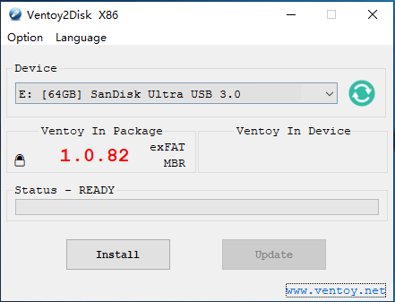

# Ventoy

[Ventoy](https://www.ventoy.net/en/index.html) é uma ferramenta de código aberto para criar uma unidade USB inicializável para arquivos ISO/WIM/IMG/VHD(x)/EFI.

Com o ventoy, você não precisa formatar o disco repetidamente, basta copiar os arquivos ISO/WIM/IMG/VHD(x)/EFI para a unidade USB e inicializá-los diretamente.

## Mídia de instalação

### Instale o Ventoy na unidade USB

Baixe o pacote de instalação no [GitHub](https://github.com/ventoy/Ventoy/releases), como ventoy-x.x.xx-windows.zip e descompacte-o. Execute Ventoy2Disk.exe , selecione o dispositivo e clique no botão Instalar ou Atualizar.

!!! danger "Atenção"
    Drive USB será formatado e todos os dados serão perdidos após a instalação.

{ align=left, width="350" }
:fontawesome-solid-arrow-right-long:
{ align=right, width="350" }

### Copiar arquivos de imagem

Após a conclusão da instalação, a unidade USB será dividida em 2 partições. A 1ª partição foi formatada com o sistema de arquivos exFAT (você também pode reformatá-la manualmente com NTFS/FAT32/UDF/XFS/Ext2/3/4... Ver [Notas](https://www.ventoy.net/en/doc_disk_layout.html)). 

**Você só precisa copiar os arquivos ISO para esta partição.** Você pode colocar os arquivos iso/wim/img/vhd(x) em qualquer lugar. O Ventoy pesquisará todos os diretórios e subdiretórios recursivamente para encontrar todos os arquivos de imagem e listá-los no menu de inicialização em ordem alfabética. Além disso, você usa a configuração do plug-in para informar ao Ventoy apenas para procurar arquivos de imagem em um diretório fixo (e seus subdiretórios).

!!! info "Secure Boot"
    [Secure Boot no modo UEFI](https://www.ventoy.net/en/doc_secure.html)