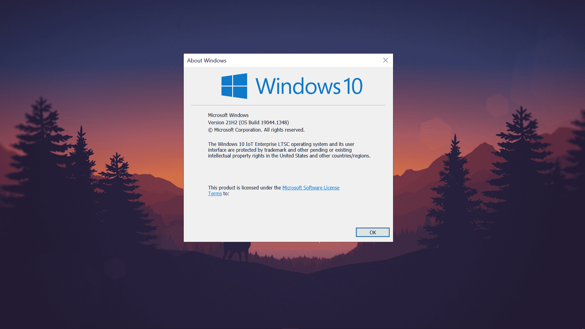

# Windows 10 Enterprise LTSC


### 1. O que é Windows 10 Bloatware?

Os PCs Windows iniciam mais devagar do que deveriam, entupidos com software pré-carregado desnecessário conhecido como bloatware. Programas como Candy Crush Soda Saga, Groove Music, Filmes & TV etc. são pré-instalados. Estes aplicativos rodam em segundo plano e reduzem a velocidade dos computadores e degradam muito o desempenho sem que os usuários o saibam. Mesmo que você dê uma olhada em seu menu inicial no Windows 10, você notará um monte de aplicativos que são uma porcaria completa e nunca os usa.


### 2. Por que não usar apenas um Debloater em uma ISO padrão do Windows 10?

**Mesmo que você tenha usado um Debloater no seu Windows 10, a Microsoft irá reinstalar uma ou outra porcaria com um patch de segurança ou forçar a instalação de atualizações em segundo plano ou, por algum motivo, a atualização do Windows quebrará seu PC e se tornará inutilizável.**

### 3. O que é [**Windows 10 Enterprise LTSC**](https://learn.microsoft.com/en-us/windows/whats-new/ltsc/whats-new-windows-10-2021)?

O Long-Term Servicing Channel (LTSC) foi projetado para dispositivos Windows 10 e casos de uso em que o principal requisito é que a funcionalidade e os recursos não mudem com o tempo. **Em palavras simples, as principais atualizações de recursos não serão atualizadas nesta versão do Windows, portanto, basicamente, o Windows não será interrompido dessa maneira. Já que todo o bloatware foi removido e ficou muito mais leve, por que não tentar pelo menos uma vez! O pior é que a Microsoft não divulgou muito sobre essa versão do Windows já que não quer que as pessoas usem e agora até se arrependem de tê-la feito 🤡.**

### **FAQ**​

??? question "Por que usar?"
    - Nenhum aplicativo pré-instalado (Candy Crush Saga, Onenote para Windows 10, música Groove, etc.)
    - Nenhuma atualização forçada
    - Sem **CORTANA** [**(LEIA SOBRE)**](https://sensorstechforum.com/cortana-data-collection/), Windows Store, etc.
    - Desempenho extra e mais estabilidade.
    - Não haverá anúncios estranhos no menu Iniciar e os aplicativos da Microsoft não serão instalados automaticamente.
    - Os aplicativos em segundo plano não serão mais executados, pois todos os aplicativos pré-instalados foram removidos.
    - O ISO é de apenas 4,5 GB em comparação com o ISO padrão do Windows 10, que tem cerca de 6 GB. (É maior que o Windows 10 LTSC 2019, pois o LTSC agora é 21H2 com novidades)

??? question "Haverá problemas de compatibilidade e hardware?"
    O Windows 10 LTSC Enterprise 2021 agora é baseado no 21H2 que veio há alguns dias (portanto, a maioria dos sites está desatualizada, pois está falando do Windows 10 LTSC 1809). **Como o Windows 10 LTSC Enterprise 2021 é baseado no 21H2, assim como a versão normal do Windows, provavelmente haverá problemas de compatibilidade com o hardware.**

??? question "O Windows 10 LTSC está atualizado?"
    As atualizações de recursos são oferecidas em novas versões do LTSC a cada 2 a 3 anos, em vez de a cada 6 meses. Como o Windows 10 encerrará o suporte em 14 de outubro de 2025, haverá pelo menos uma atualização de recurso em 2023 ou 2024, portanto, estará quase atualizado como o Windows normal.

??? question "Até quando o Windows 10 LTSC será compatível e quais são as diferenças entre IoT e não-IoT?"
    O LTSC vem em duas versões IoT e não IoT. Abaixo estão as diferenças escritas:

    |                                                | **não-IoT**                                | **IoT**                                                        |
    |------------------------------------------------|--------------------------------------------|----------------------------------------------------------------|
    | **Data final do ciclo de vida**                | Jan 12, 2027                               | Jan 13, 2032                                                   |
    | **Tipo de chave genérica**                     | KMS                                        | RTM                                                            |
    | **¹Chave genérica incorporada no arquivo ISO** | ```M7XTQ-FN8P6-TTKYV-9D4CC-J462D```        | ```QPM6N-7J2WJ-P88HH-P3YRH-YY74H```                            |
    | **Método de ativação**                         | KMS                                        | Digital License (HWID)                                         |
    | **Idiomas disponíveis para arquivos ISO**      | Todos os idiomas nativos disponíveis.      | Somente ```en-us``` "Inglês (Estados Unidos)" está disponível. |

    [¹Chave genérica](https://learn.microsoft.com/en-us/windows-server/get-started/kms-client-activation-keys)

??? question "Devo optar por IoT ou não-IoT?"
    As diferenças acima são bastante inúteis, pois o não-IoT pode ser convertido em IoT com a ajuda do [MAS](https://github.com/massgravel/Microsoft-Activation-Scripts/releases), que é usado para ativar o Windows. **Portanto, você ainda terá suporte de fim de vida até 2032 e ativação HWID.**

??? question "Preciso da Microsoft Store?"
    A instalação da loja meio que destrói o objetivo do LTSC, eu acho? Mas muitos laptops para jogos precisam de software como o Lenovo Vantage, o Asus Armory Crate requer UWP. Além disso, como a NVIDIA parou de oferecer suporte a drivers não UWP legados que não precisavam da loja da Microsoft, significa que não há mais atualizações forçando você a usar drivers nvidia UWP infelizmente :(
    
    **Para instalar a loja, abra o CMD como administrador e digite o seguinte código:**
    ```
    WSReset -i&&TimeOut 20&&WSReset -i&&exit
    ```

### **Ativando o Windows 10 Enterprise LTSC**

Como comprar uma chave legítima do Windows 10 LTSC é muito caro, usaremos um ativador do Windows 10 para ativar o Windows 10 LTSC gratuitamente!

!!! info ""
    Veja como ativar na sessão [MAS](../MAS)