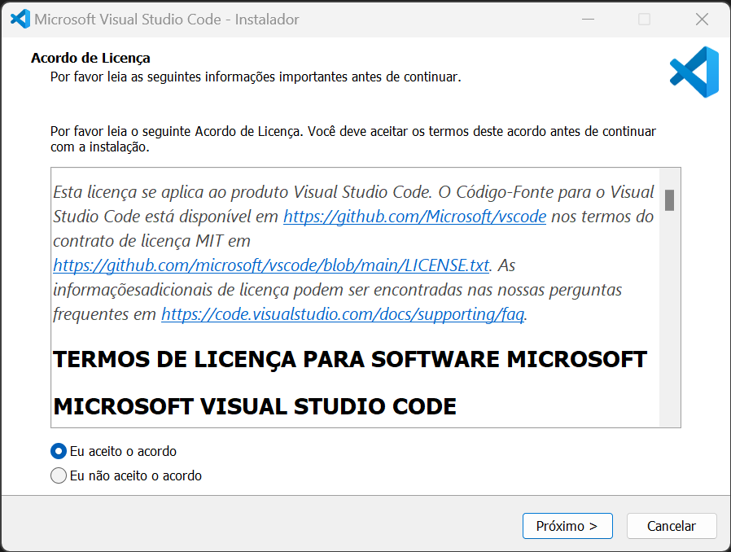
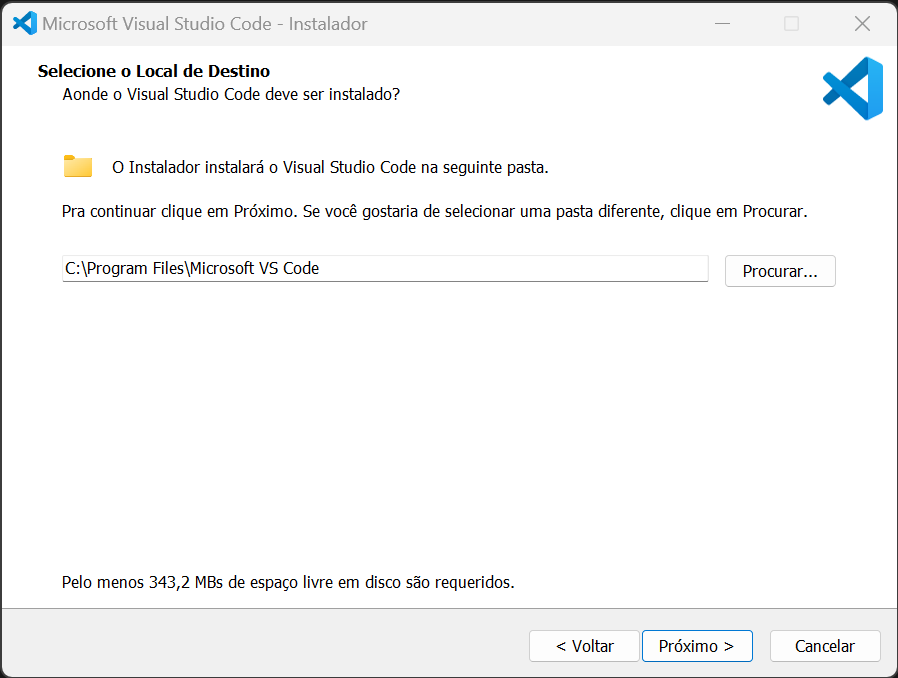
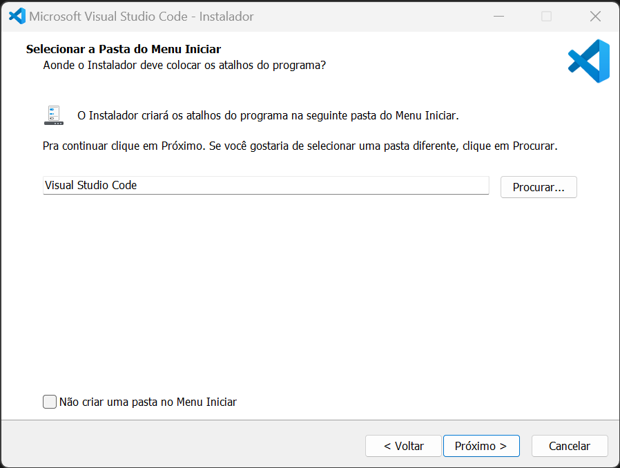
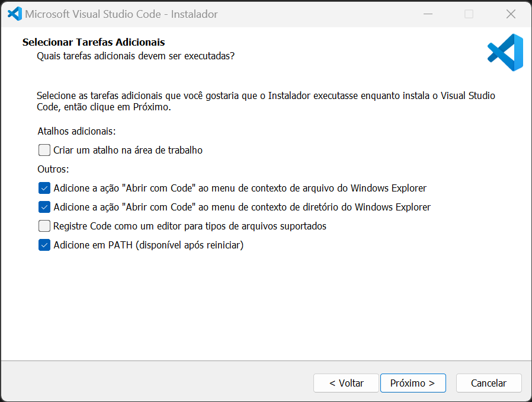
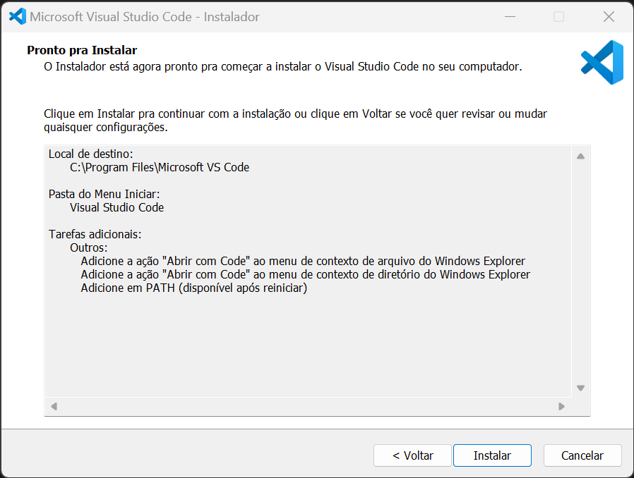
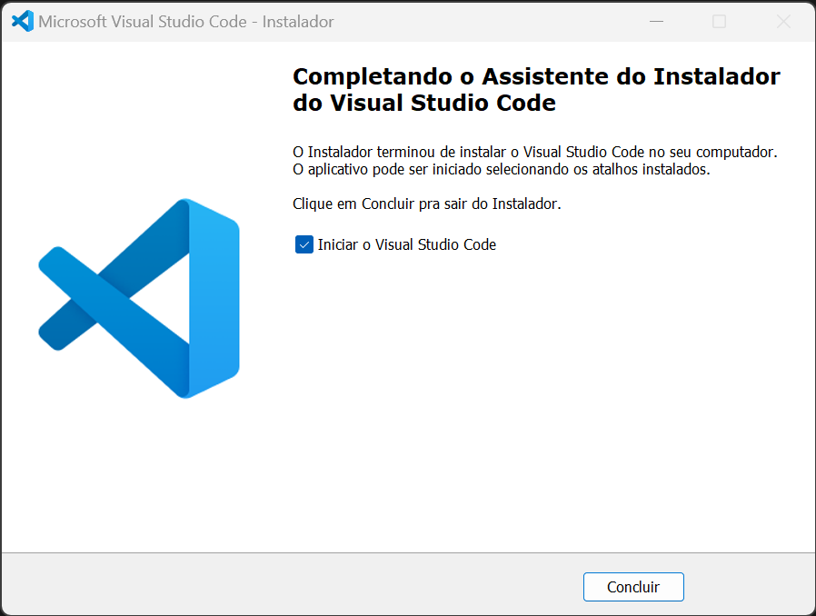

# VapourSynth

https://jaded-encoding-thaumaturgy.github.io/JET-guide/

!!! info "Sistemas"
    - Windows 11 (Mais recente)

## **Instalação**


**Primeiramente faça download dos seguintes programas:**

- [:fontawesome-brands-python: __Python__](https://www.python.org/downloads/)
- [:fontawesome-solid-microchip: __VapourSynth (x64)__](https://github.com/vapoursynth/vapoursynth/releases/)
- [:fontawesome-solid-code: __VS Code (System Installer)__](https://code.visualstudio.com/sha/download?build=stable&os=win32-x64)

***

**Prossiga com a instalação e configuração:**

### Python

=== "Python #1"

    

=== "Python #2"

    

=== "Python #3"

    

=== "Python #4"

    

=== "Python #5"

    

=== "Python #6"

    

### VapourSynth

=== "VapourSynth #1"

    

=== "VapourSynth #2"

    

=== "VapourSynth #3"

    

=== "VapourSynth #4"

    

=== "VapourSynth #5"

    

=== "VapourSynth #6"

    

### VS Code (System Installer)

=== "VS Code #1"

    

=== "VS Code #2"

    

=== "VS Code #3"

    

=== "VS Code #4"
    !!! danger "Etapa importante!"
        - Desmarque a opção "Registre Code como um editor para tipos de arquivos suportados". (Isso pode quebrar o funcionamento do Python)
        - Deixe marcado as opções exatamente como na imagem!
    

    

=== "VS Code #5"

    

=== "VS Code #6"

    


## **Dependências (Python)**

!!! warning ""
    Abra `CMD` como Administrador

Execute os sequintes comandos:

!!! example "[JET](https://github.com/Jaded-Encoding-Thaumaturgy)"
    ```
    pip install vsjet
    ```
    ```
    py -m vsjet latest
    ```

!!! example "Vodes [test](https://muxtools.vodes.pw/)"

    ```
    pip install git+https://github.com/Vodes/vodesfunc.git
    ```
    ```
    pip install git+https://github.com/Jaded-Encoding-Thaumaturgy/muxtools.git
    ```
    ```
    pip install git+https://github.com/Jaded-Encoding-Thaumaturgy/vs-muxtools.git
    ```

## **Plugins ([BETA])**

Faça download dos plugins a seguir:

{{ read_excel('_resources/vapoursynth/plugins.xlsx', engine='openpyxl') }}

!!! warning "Atenção"
    - DGDecNV requer configuração adicional, adicionar pasta no **PATH** do Windows e copiar a DLL `DGDecodeNV.dll` para a pasta `C:\Program Files\VapourSynth\plugins`, como na imagem:
    ***
    - BM3DCUDA possui otimização para alguns CPUs, extraia a DLL de acordo com a sua CPU:
    
    Pesquise qual a sua CPU:

    `bm3dcpu-alderlake.dll`
    - **[Intel® Alder Lake](https://ark.intel.com/content/www/us/en/ark/products/codename/147470/products-formerly-alder-lake.html)**

    `bm3dcpu-haswell.dll`
    - **[Intel® Haswell](https://ark.intel.com/content/www/us/en/ark/products/codename/42174/products-formerly-haswell.html)**

    `bm3dcpu-icelake-client.dll`
    - **[Intel® Ice Lake](https://ark.intel.com/content/www/us/en/ark/products/codename/74979/products-formerly-ice-lake.html)**

    `bm3dcpu-skylake.dll`
    - **[Intel® Skylake](https://ark.intel.com/content/www/us/en/ark/products/codename/37572/products-formerly-skylake.html)**

    `bm3dcpu-znver1.dll` - Ryzen 1000 / 2000
    
    `bm3dcpu-znver2.dll` - Ryzen 3000 / 4000

    `bm3dcpu-znver3.dll` - Ryzen 5000

    Depois de certificar qual a sua CPU, selecione e extraia junto com as DLLs `bm3dcuda.dll` `bm3dcuda_rtc.dll` e copie para a pasta `C:\Program Files\VapourSynth\plugins`, como na imagem: