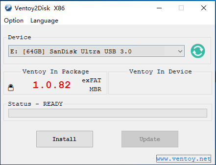
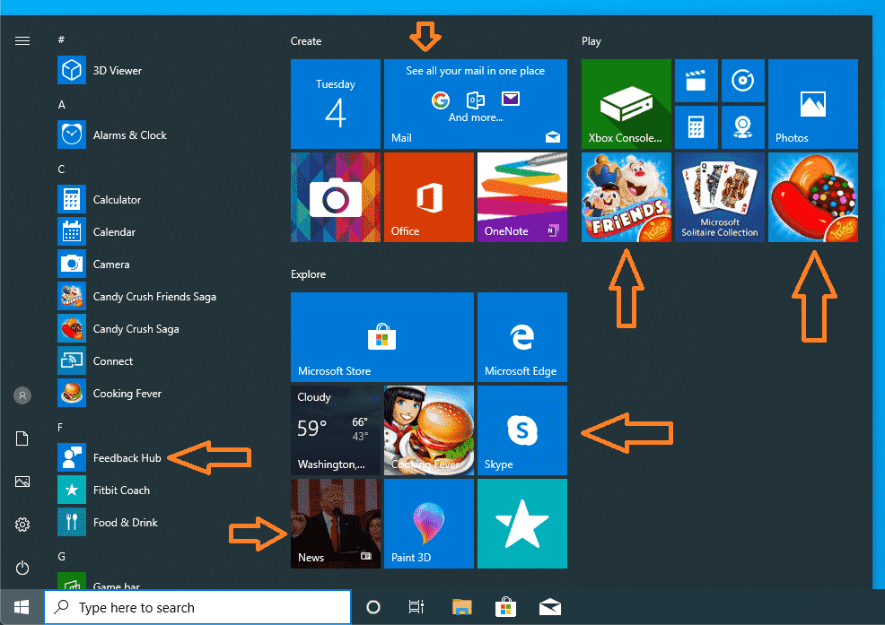
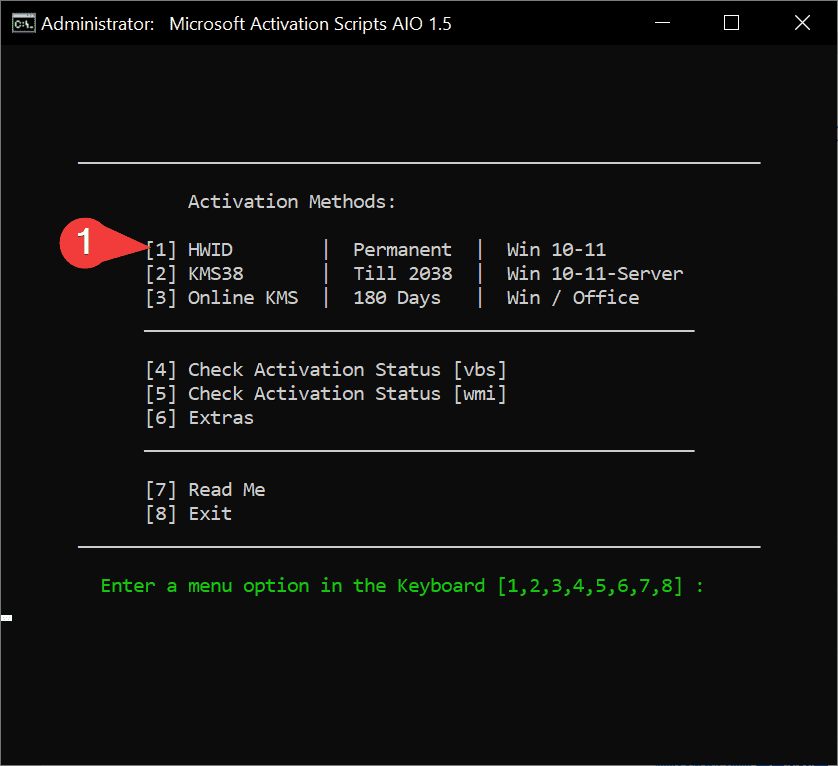
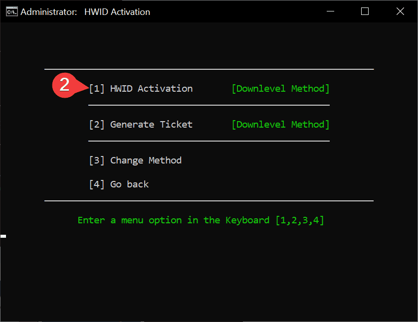

# Windows

## Tools

- [Microsoft Activation Scripts (MAS)](https://massgrave.dev)
- [MAS (Releases)](https://github.com/massgravel/Microsoft-Activation-Scripts/releases)
    
    Um ativador do Windows e do Office usando métodos de ativação HWID / KMS38 / KMS online, com foco em código-fonte aberto e menos detecções de antivírus.

***

- [ISO: Windows 10 Enterprise LTSC 2021](https://opendirectory.luzea.de/luzea/Windows_10_Enterprise_LTSC_2021/)

***

- [Office Tool Plus](https://otp.landian.vip/en-us)

    Office Tool Plus baseado na Office Deployment Tool (ODT), você pode implantar o Office com muita facilidade.

***

- [Ventoy](https://www.ventoy.net/en/index.html)

    Ventoy é uma ferramenta de código aberto para criar uma unidade USB inicializável para arquivos ISO/WIM/IMG/VHD(x)/EFI.

    Com o ventoy, você não precisa formatar o disco repetidamente, basta copiar os arquivos ISO/WIM/IMG/VHD(x)/EFI para a unidade USB e inicializá-los diretamente.

## Mídia de instalação

### Instale o Ventoy na unidade USB

Baixe o pacote de instalação, como ventoy-x.x.xx-windows.zip e descompacte-o. Execute Ventoy2Disk.exe , selecione o dispositivo e clique no botão Instalar ou Atualizar.

!!! danger "Atenção"
    Drive USB será formatado e todos os dados serão perdidos após a instalação.

{ align=left, width="350" }
:fontawesome-solid-arrow-right-long:
{ align=right, width="350" }

### Copiar arquivos de imagem

Após a conclusão da instalação, a unidade USB será dividida em 2 partições. A 1ª partição foi formatada com o sistema de arquivos exFAT (você também pode reformatá-la manualmente com NTFS/FAT32/UDF/XFS/Ext2/3/4... Ver [Notas](https://www.ventoy.net/en/doc_disk_layout.html)). 

**Você só precisa copiar os arquivos ISO para esta partição.** Você pode colocar os arquivos iso/wim/img/vhd(x) em qualquer lugar. O Ventoy pesquisará todos os diretórios e subdiretórios recursivamente para encontrar todos os arquivos de imagem e listá-los no menu de inicialização em ordem alfabética. Além disso, você usa a configuração do plug-in para informar ao Ventoy apenas para procurar arquivos de imagem em um diretório fixo (e seus subdiretórios).

!!! info "Secure Boot"
    [Secure Boot no modo UEFI](https://www.ventoy.net/en/doc_secure.html)

## Windows 10 Enterprise LTSC (A melhor versão do Windows 10 de todos os tempos!)


### 1. O que é Windows 10 Bloatware?

Os PCs Windows iniciam mais devagar do que deveriam, entupidos com software pré-carregado desnecessário conhecido como bloatware. Programas como Candy Crush Soda Saga, Groove Music, Filmes & TV etc. são pré-instalados. Estes aplicativos rodam em segundo plano e reduzem a velocidade dos computadores e degradam muito o desempenho sem que os usuários o saibam. Mesmo que você dê uma olhada em seu menu inicial no Windows 10, você notará um monte de aplicativos que são uma porcaria completa e nunca os usa.



### 2. Por que não usar apenas um Debloater em uma ISO padrão do Windows 10?

**Mesmo que você tenha usado um Debloater no seu Windows 10, a Microsoft irá reinstalar uma ou outra porcaria com um patch de segurança ou forçar a instalação de atualizações em segundo plano ou, por algum motivo, a atualização do Windows quebrará seu PC e se tornará inutilizável.**

### 3. O que é [**Windows 10 Enterprise LTSC**](https://learn.microsoft.com/en-us/windows/whats-new/ltsc/whats-new-windows-10-2021)?

O Long-Term Servicing Channel (LTSC) foi projetado para dispositivos Windows 10 e casos de uso em que o principal requisito é que a funcionalidade e os recursos não mudem com o tempo. **Em palavras simples, as principais atualizações de recursos não serão atualizadas nesta versão do Windows, portanto, basicamente, o Windows não será interrompido dessa maneira. Já que todo o bloatware foi removido e ficou muito mais leve, por que não tentar pelo menos uma vez! O pior é que a Microsoft não divulgou muito sobre essa versão do Windows já que não quer que as pessoas usem e agora até se arrependem de tê-la feito 🤡.**

### **Ativando o Windows 10 Enterprise LTSC**

Como comprar uma chave legítima do Windows 10 LTSC é muito caro, usaremos um ativador do Windows 10 para ativar o Windows 10 LTSC gratuitamente!


!!! info "**Método 1 - PowerShell**"
    - No Windows 10/11, clique com o botão direito do mouse no menu Iniciar do Windows, selecione PowerShell ou Terminal
    - Copie e cole o código abaixo e pressione enter 
     ```
     irm https://massgrave.dev/get | iex
     ```
    - Você verá as opções de ativação, siga as instruções na tela
    - Isso é tudo

!!! info "**Método 2 - Tradicional**"
    - Baixe o arquivo ```MAS_1.7_Password_1234.7z``` daqui: [MAS (Releases)](https://github.com/massgravel/Microsoft-Activation-Scripts/releases)
    - Extraia este arquivo com um gerenciador de arquivos de terceiros, como o [7zip](https://www.7-zip.org/download.html)
    - A senha é 1234
    - Na pasta extraída, encontre a pasta chamada **All-In-One-Version**
    - Execute o arquivo chamado **MAS_AIO.cmd**
    - Você verá as opções de ativação, siga as instruções na tela
    - Isso é tudo

Para ativar o Windows com o ativador:


