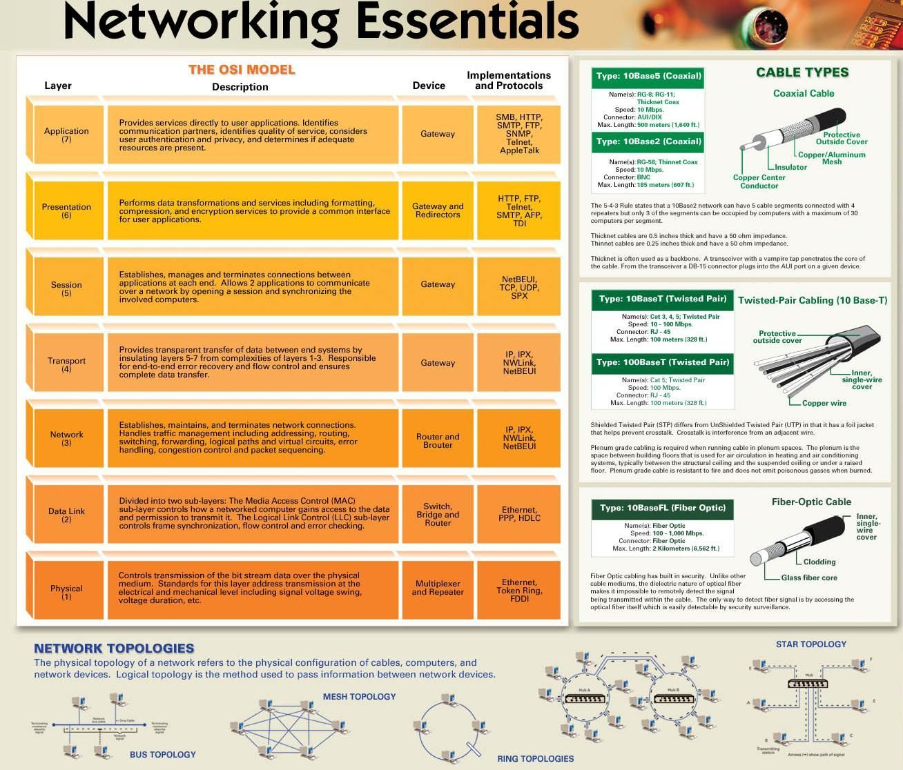

# Awesome Hacking

- [Hacking Articles- Cyber Mindmap](https://github.com/Ignitetechnologies/Mindmap)
> Este repositório conterá muitos mapas mentais para tecnologias, metodologias, cursos e certificações de segurança cibernética em uma estrutura de árvore para fornecer breves detalhes sobre eles

***

- [Cloud Digital Architecture](https://github.com/jganggini/cloud-digital-architecture)
> Mapas mentais relacionado a Arquiteturas Cloud

***

- [ForensicsTools](https://github.com/mesquidar/ForensicsTools)
> Uma lista de ferramentas de análise forense gratuitas e abertas e outros recursos

***

- [Awesome Social Engineering](https://github.com/giuliacassara/awesome-social-engineering)
> Uma lista de recursos incríveis para engenharia social.

***

- [Awesome OSINT](https://github.com/jivoi/awesome-osint)
> Uma lista de OSINT incrivelmente incríveis

***

- [OSINT Framework](https://osintframework.com/)
> Estrutura OSINT focada na coleta de informações de ferramentas ou recursos gratuitos. A intenção é ajudar as pessoas a encontrar recursos OSINT gratuitos. Alguns dos sites incluídos podem exigir registro ou oferecer mais dados por $$$, mas você deve conseguir obter pelo menos uma parte das informações disponíveis sem nenhum custo.

## Arquivos

??? info "**PDFs**"
    - [Wordlists For Pentester](_resources/Awesome Hacking/1680332824466.pdf)

??? info "**Cloud Comparison**"
    

??? info "**Network Essentials**"
    